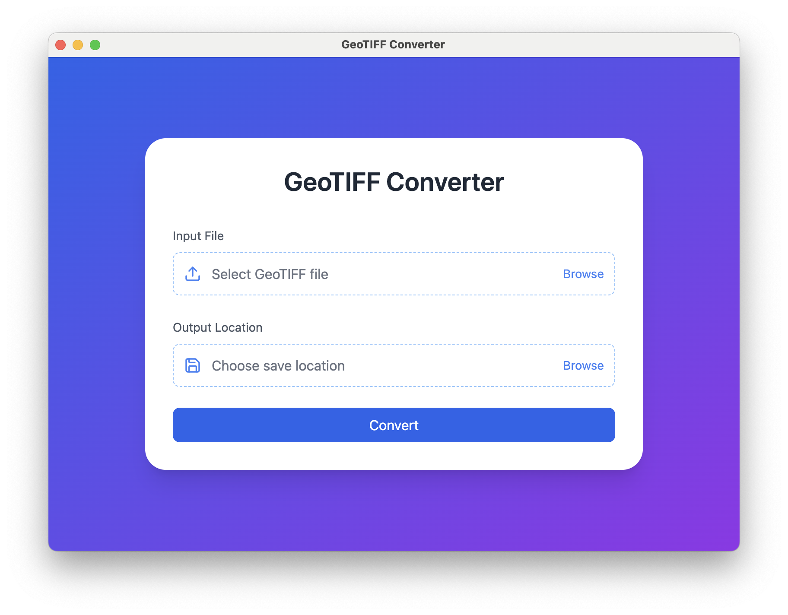

**README.md**

---

# GeoTIFF Converter

A desktop application (built with [Electron](https://www.electronjs.org/), [React](https://react.dev/), and [Tailwind CSS](https://tailwindcss.com/)) that allows you to convert standard GeoTIFF files into pyramidal tiled GeoTIFFs (with WebP compression) using [Sharp](https://github.com/lovell/sharp).




## Features

- **User-friendly interface** for selecting an input GeoTIFF and specifying an output file path.
- **Progress updates** during conversion, based on a rough heuristic.
- **Tile and pyramid creation** for large GeoTIFFs.
- **WebP compression** to reduce file size.

## Getting Started

### Prerequisites

- [Node.js](https://nodejs.org/) (version 16 or above recommended)
- [npm](https://www.npmjs.com/) (comes bundled with Node)
- [Electron](https://www.electronjs.org/) is automatically installed via `npm install`.

### Installation

1. **Clone** this repository or [download the zip](https://github.com/devbharat/geotiff-converter/archive/refs/heads/main.zip).
2. Navigate into the project directory:
   ```bash
   cd geotiff-converter
   ```
3. Install dependencies:
   ```bash
   npm install
   ```

### Development

When developing, you’ll want to run the React frontend in watch mode, build the Tailwind CSS, and start Electron. This repo simplifies that process. Generally, you can just run:

```bash
npm run build
npm start
```

This command:
- Runs Electron, which will load the built files from the `public` folder.
- Automatically reloads if you make changes to the React app and rebuild.

> **Note**: By default, `electron-reload` is watching for changes in the `public` folder. When you modify React files in `src`, you need to rebuild them so that the output in `public` is updated.

### Building for Production

To generate a production build of the React app and Tailwind CSS, run:

```bash
npm run build
```

This will:

1. Compile Tailwind CSS (from `./src/index.css` to `./public/style.css`).
2. Copy the newly compiled `style.css` back into `src`.
3. Build the React application via Vite into the `public` folder.

After that, you can run `npm start` to launch the Electron app in a production-like state.

### Packaging the Electron App

You can package this application into a standalone executable using [electron-packager](https://www.npmjs.com/package/electron-packager). For example:

```bash
npx electron-packager . GeoTIFFConverter --platform=darwin --arch=x64 --out=release-build --icon=assets/appIcon
```

Adjust the platform, arch, and other options as needed. This will create an executable or app bundle (depending on your operating system) in the `release-build` folder.

## Usage

1. **Launch** the app (via `npm start` or by running the packaged executable).
2. **Select an input GeoTIFF** by clicking **Select GeoTIFF file**.
3. **Choose an output location** (file path) for the converted GeoTIFF.
4. Click **Convert**. A progress indicator (circular or textual) will show you the estimated conversion progress.
5. When finished, the app will display a success message (or an error if something went wrong).

## License

This project is licensed under the [MIT License](https://opensource.org/licenses/MIT). See the [LICENSE](LICENSE) file for details.
